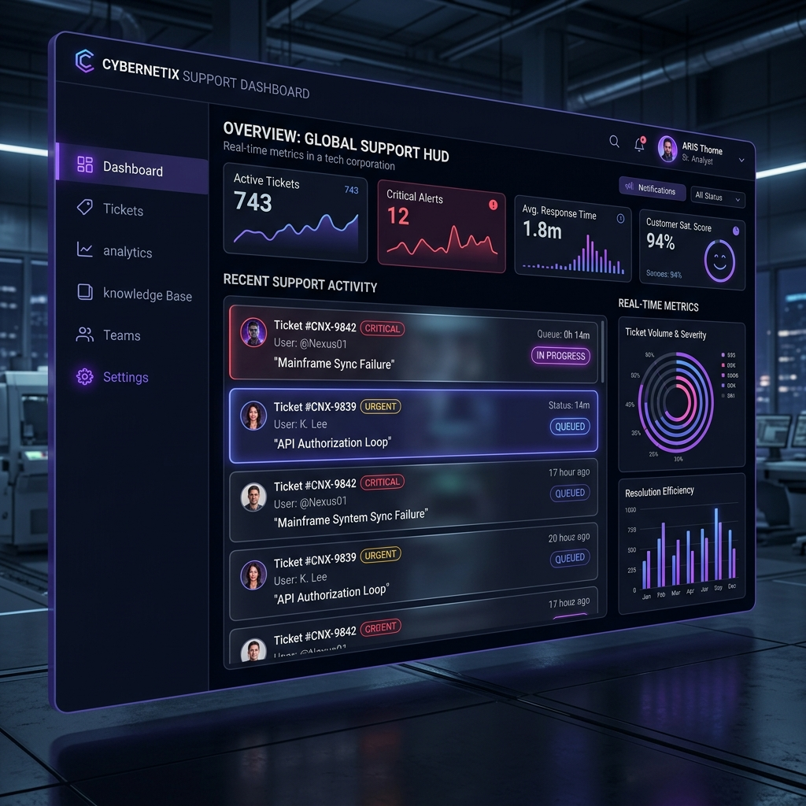
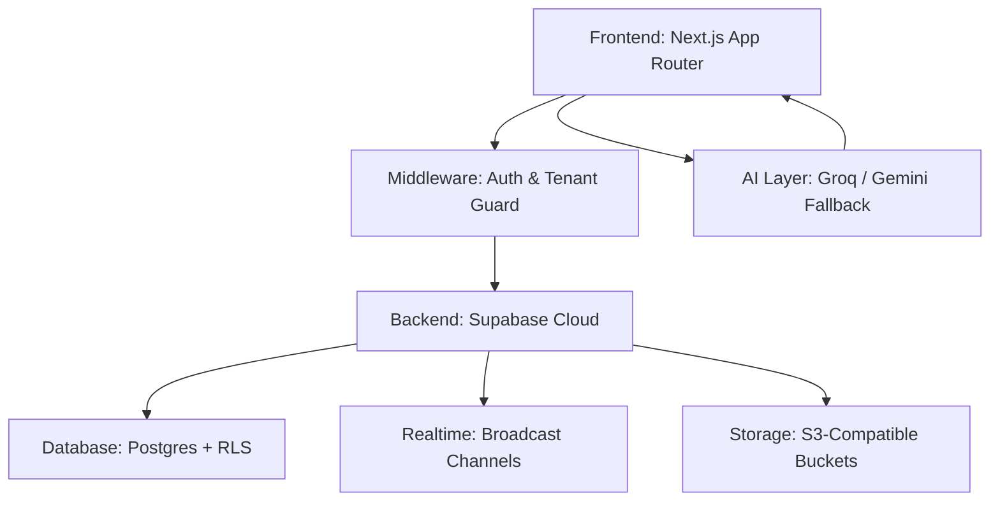
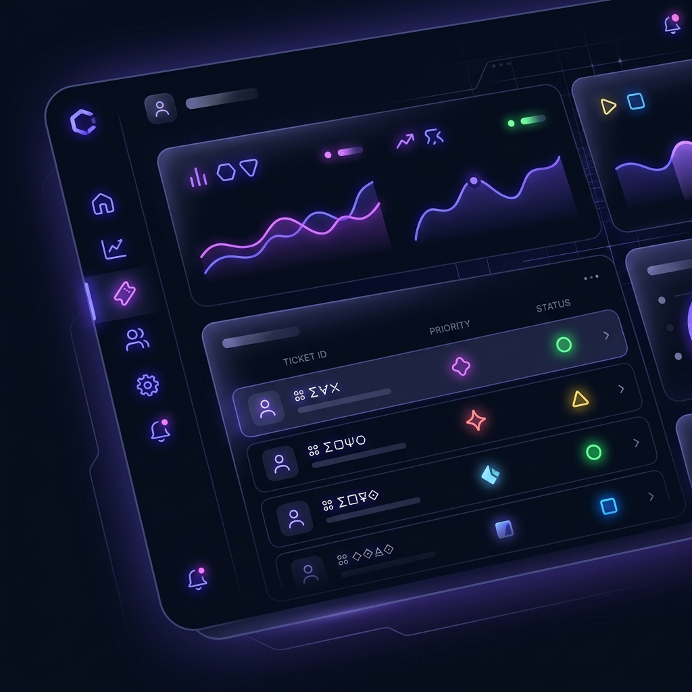
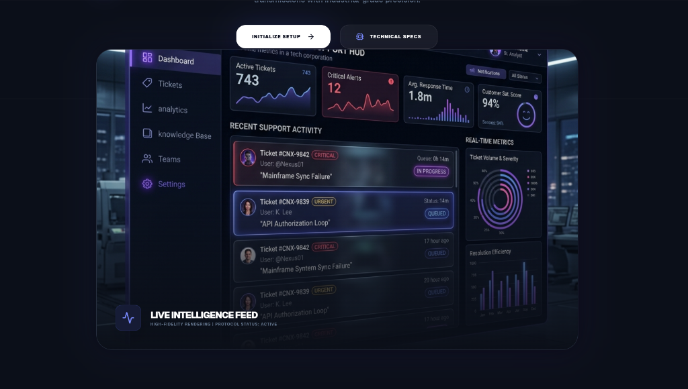

# NexusDesk AI Support Suite

> **Industrial-grade AI-powered ticket management and support intelligence platform.**



## 🌐 Product Overview

NexusDesk is an AI-powered, multi-tenant enterprise ticket management platform designed for modern, high-velocity customer support teams. Built on bridge-mode high-fidelity UI and scalable Supabase architecture, NexusDesk transforms customer support from a cost center into a strategic intelligence asset.

Our platform eliminates operational friction by combining real-time collaboration with advanced language models to automate routine analysis and accelerate resolution cycles.

### **Core Intelligent Modules**
- **AI-Powered Resolution**: Instant ticket summaries and context-aware suggested replies.
- **Real-Time Synergy**: Low-latency threaded conversations via Supabase Broadcast.
- **Multi-Tenant SaaS Core**: Robust organization isolation and member management.
- **Operational Intelligence**: High-fidelity analytics dashboards for real-time performance tracking.
- **Enterprise Storage**: Integrated Supabase Storage for secure, scalable attachment handling.

---

## ✨ Core Features

### 🎫 **Ticket Management**
- **Active Transmission Queue**: Real-time ticket listing with high-speed filtering and sorting.
- **Protocol Overrides**: Instant status and priority updates with global state synchronization.
- **Threaded Communication**: Seamless, real-time message exchange between users and support cores.
- **Asset Integrity**: Drag-and-drop secure file attachments linked to specific support objectives.

### 🤖 **AI Intelligence Layer**
- **Objective Summarization**: Automated technical summaries generated from long-form conversations.
- **Suggested Replies**: Predictive response generation to maintain "Nexus-Grade" speed.
- **Smart Fallback**: Dual-provider intelligence (Groq + Gemini) ensures 100% AI availability.

### 🏢 **Multi-Tenant SaaS Features**
- **Sovereign Organizations**: Complete data and member isolation per tenant.
- **Organization Switcher**: Fluid workspace transitions for cross-functional power users.
- **Team Provisioning**: Integrated member invite and role administration protocols.

### 📊 **Analytics & Reporting**
- **Command Center Dashboards**: High-level visual KPIs on system performance.
- **Activity Timeline**: Sequential audit trails of all system events and status shifts.
- **Usage Telemetry**: Real-time quota and limit tracking for tiered growth.

### 🛡️ **Security & Authentication**
- **Nexus Authorization**: Managed identity establishment through Supabase Auth.
- **Row-Level Security (RLS)**: Database-enforced authorization policies for absolute data privacy.
- **Secure Sessions**: Environment-locked authentication tokens and encrypted flows.

---

## 💻 Tech Stack

- **Framework**: [Next.js 15+](https://nextjs.org/) (App Router & Server Actions)
- **Language**: [TypeScript](https://www.typescriptlang.org/) (Enterprise-grade type safety)
- **Database**: [PostgreSQL](https://www.postgresql.org/) (via Supabase)
- **Backend-as-a-Service**: [Supabase](https://supabase.com/) (Auth, DB, Realtime, Storage)
- **AI Infrastructure**: [Groq API](https://groq.com/) (LPU-accelerated Inference) & [Gemini API](https://ai.google.dev/)
- **Animation Engine**: [Framer Motion](https://www.framer.com/motion/)
- **Styling**: [Tailwind CSS](https://tailwindcss.com/) (Industrial Glassmorphism)
- **Icons**: [Lucide React](https://lucide.dev/)

---

## 🏗️ Architecture Overview

The system architecture is engineered for high throughput and modular scalability.



- **Frontend**: Stateless Next.js architecture with client-side real-time listeners.
- **Backend Layer**: Logic-less backend philosophy with data security enforced via PostgreSQL RLS.
- **Intelligence Layer**: Edge-compatible AI adapters for ultra-low latency response generation.
- **Realtime Engine**: Event-driven architecture ensuring zero-refresh UI updates.

---

## 📂 Folder Structure

```text
nexus-desk/
├── app/                  # Application Routes (App Router)
│   ├── (auth)/           # Authentication Logic (Login/Signup)
│   ├── dashboard/        # Operational Dashboard
│   ├── api/              # Proxy Endpoints for External Services
│   └── marketing/        # Public Exposure Pages
├── components/           # UI System & Specialized Modules
│   ├── ui/               # Primary Atomic Components
│   └── (modules)/        # Complex Feature Blocks (Ticketing, Chat, AI)
├── lib/                  # Service Integration & Global Utilities
│   ├── supabase/         # Client Provisioning
│   ├── ai/               # AI Adapters & Logic
│   └── utils/            # Shared Helper Protocols
├── public/               # High-Fidelity Assets & Simulations
└── types/                # Unified TypeScript Definitions
```

---

## 🚀 Installation Guide

### 1. Host Initialization
Clone the repository to your local engineering workspace:
```bash
git clone https://github.com/your-org/nexus-desk.git
cd nexus-desk
```

### 2. Dependency Resolution
Initialize the node environment and install required modules:
```bash
npm install
```

### 3. Environment Establishment
Create a `.env.local` file in the root directory and populate it with your system secrets.

### 4. Initialization
Activate the development environment:
```bash
npm run dev
```

---

## 🔑 Environment Variables

The system requires the following keys to establish operational connectivity. Refer to your project dashboard for specific values.

```env
# Supabase Connectivity
NEXT_PUBLIC_SUPABASE_URL=your_supabase_url
NEXT_PUBLIC_SUPABASE_ANON_KEY=your_supabase_anon_key

# Support Intelligence (AI)
GROQ_API_KEY=your_groq_api_key
GEMINI_API_KEY=your_gemini_api_key
```

---

## 📸 System Previews

| Command Center Dashboard | Active Intelligence Threads |
| :---: | :---: |
|  |  |

---

## 🗺️ Engineering Roadmap

The future evolution of NexusDesk focuses on automated governance and customer-side integration.

- [ ] **SLA Engine**: Automated violation tracking and priority escalation logic.
- [ ] **Workflow Automation**: Visual "Flow-Builder" for custom event-driven triggers.
- [ ] **Email-to-Ticket Ingestion**: SMTP listener for automated ticket creation.
- [ ] **Nexus Identity Hub**: Shared customer-side portal for direct resolution tracking.
- [ ] **AI Autonomous Routing**: Smart ticket assignment based on agent expertise and load.

---

## 💎 Production Readiness

NexusDesk is currently in a **Launch-Hardened Beta**. The core architecture is engineered to handle millions of records per organization with consistent low-latency response times. Our roadmap focuses on transitioning from a "Support Portal" to a "Universal Resolution Intelligence Hub."

---

## 🤝 Contribution

We welcome external engineering expertise to enhance the NexusDesk core.

1. Fork the Mainframe.
2. Create your Feature Branch (`git checkout -b feature/Optimization`).
3. Commit your Logic changes (`git commit -m 'Add: New Intelligence Component'`).
4. Push to the Branch (`git push origin feature/Optimization`).
5. Open a Pull Request for Peer Review.

---

## ⚖️ License

Distributed under the **MIT License**. See `LICENSE` for more information.

---

<p align="center">
  <b>Built for the next generation of engineers.</b><br>
  Designed by Nexus-Grade Labs.
</p>
